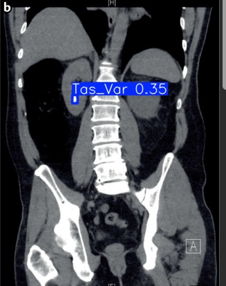
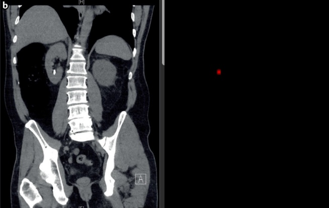

# 🏥 Light Weight Explainable Model For Kidney Stone Detection using KUB X-Rays

A lightweight, real-time kidney stone detection system powered by YOLOv8 with multi-level explainability for clinical decision support.


## ✨ Features

- **Real-Time Detection**: 8-10ms inference on GPU, ~100ms on CPU
- **Lightweight Model**: Only 6MB (YOLOv8-nano)
- **Multi-Level Explainability**:
  - Level 1: Pixel-level attention (GradCAM)
  - Level 2: Region-level analysis
  - Level 3: Clinical prognosis
- **Clinical Analysis**: Severity assessment, treatment recommendations
- **Batch Processing**: Process multiple images simultaneously

## 📁 Project Structure

```
Light-Weight-Explainable-Model-For-Kidney-Stone-Detection-using-KUB-X-Rays/
├── src/
│   ├── __init__.py
│   └── app/
│       ├── __init__.py
│       ├── main.py                    # Flask application & routes
│       ├── config.py                  # Configuration settings
│       ├── models/
│       │   └── best.pt                # Trained YOLOv8-nano model (6MB)
│       ├── static/
│       │   ├── css/                   # Stylesheets
│       │   ├── js/                    # JavaScript files
│       │   └── results/               # Detection results output
│       ├── templates/
│       │   └── index.html             # Main UI template (dark theme)
│       ├── uploads/                   # Uploaded images directory
│       └── utils/
│           ├── __init__.py
│           ├── explainability.py      # Multi-level explainability (GradCAM)
│           ├── advanced_explainability.py  # Integrated Gradients, Attention Flow
│           └── clinical_relevance.py  # Clinical analysis & recommendations
├── data/
│   ├── data.yaml                      # Dataset configuration
│   ├── train/                         # Training images & labels
│   ├── valid/                         # Validation images & labels
│   └── test/                          # Test images & labels
├── docs/
│   ├── API_DOCUMENTATION.md           # API endpoints documentation
│   ├── DEPLOYMENT_GUIDE.md            # Deployment instructions
│   ├── INSTALLATION.md                # Installation guide
│   ├── PROJECT_SUMMARY.md             # Project overview
│   └── images/                        # Documentation images
├── scripts/
│   ├── train.py                       # Model training script
│   ├── evaluate.py                    # Model evaluation script
│   ├── inference.py                   # Inference script
│   ├── explainability.py              # Explainability generation
│   └── real_time.py                   # Real-time detection
├── tests/
│   ├── __init__.py
│   ├── test_app.py                    # Application tests
│   └── simple_test.py                 # Simple functionality tests
├── logs/                              # Application logs
├── uploads/                           # Global uploads directory
├── run.py                             # Application entry point
├── requirements.txt                   # Python dependencies
├── .gitignore                         # Git ignore rules
└── README.md                          # This file
```

## 🚀 Quick Start

### 1. Clone the Repository
```bash
git clone https://github.com/jagandevloper/Light-Weight-Explainable-Model-For-Kidney-Stone-Detection-using-KUB-X-Rays.git
cd Light-Weight-Explainable-Model-For-Kidney-Stone-Detection-using-KUB-X-Rays
```

### 2. Create Virtual Environment
```bash
python -m venv venv
source venv/bin/activate  # Linux/Mac
venv\Scripts\activate     # Windows
```

### 3. Install Dependencies
```bash
pip install -r requirements.txt
```

### 4. Run the Application
```bash
python run.py
```

Open your browser at **http://localhost:5000**

## 📋 Requirements

- Python 3.8+
- PyTorch 2.0+
- CUDA (optional, for GPU acceleration)

### Core Dependencies
- Flask >= 2.0
- ultralytics >= 8.0
- torch >= 2.0
- opencv-python
- numpy
- Pillow

## 🔧 Configuration

Environment variables:
- `MODEL_PATH`: Path to custom model file
- `FLASK_DEBUG`: Enable debug mode (True/False)
- `HOST`: Server host (default: 0.0.0.0)
- `PORT`: Server port (default: 5000)

## 📖 Documentation

- [API Documentation](docs/API_DOCUMENTATION.md)
- [Deployment Guide](docs/DEPLOYMENT_GUIDE.md)
- [Installation Guide](docs/INSTALLATION.md)

## 🧪 Testing

```bash
# Run tests
python -m pytest tests/

# Run single test
python tests/test_app.py
```

## 📊 Model Performance

| Metric | Value |
|--------|-------|
| Model Size | 6 MB |
| GPU Inference | 8-10 ms |
| CPU Inference | 80-150 ms |
| mAP@0.5 | 0.85+ |

## 🖼️ Output

The system generates a comprehensive multi-level analysis for each processed KUB X-ray:

### 1. Detection Results
- **Bounding Boxes**: Precise localization of kidney stones with class labels.
- **Confidence Scores**: Statistical probability of each detection.


### 2. Multi-Level Explainability
- **Level 1: Grad-CAM Heatmaps**: Pixel-level visualization showing which areas the model focused on.
- **Level 2: Region Analysis**: Contextual information about the stone's location.
- **Level 3: Clinical Prognosis**: AI-driven severity assessment and treatment recommendations.


### 3. Clinical Report
- Summary of findings including stone count, size estimates, and anatomical localization.
- Automated clinical decision support suggestions based on the detection.


## 📄 License

This project is licensed under the MIT License - see the [LICENSE](LICENSE) file for details.

## 🙏 Acknowledgments

- [Ultralytics YOLOv8](https://github.com/ultralytics/ultralytics)
- [Flask](https://flask.palletsprojects.com/)
- Dataset from [Roboflow](https://roboflow.com/)
